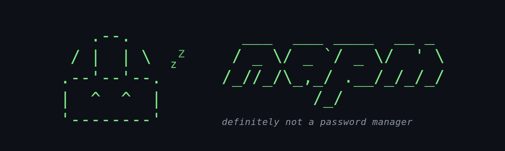

<div align="center">



</div>

# not-a-password-manager

A password notebook you run yourself. Put it on your machine or your home server, sign in with an email and a password, and keep your passwords somewhere that belongs to you.

A service, a terminal client, and a Postgres database. That is the whole thing.

This is a personal project, built in the open. It is small on purpose — one person's passwords, one machine, nobody's company behind it.

---

## Why this exists

Most password managers ask you to trust a company with your secrets. The ones that refuse to hold your data hand you a zero-knowledge design instead, and its price is absolute: forget the one password and everything you stored is gone, with nobody on earth able to help you.

This takes a third road, and it only works because of who runs it. You are the operator. The server is allowed to hold the key — it just never keeps that key next to the data. A stolen backup is a file of ciphertext. A forgotten account password is a bad afternoon, not a catastrophe.

That is a trade, not a stronger design. The table below is the honest version of it, and it is worth reading before you decide this fits you.

## What running it yourself means

There is nothing to sign up for. No service of mine, no plan, no account anywhere. You clone the repository, start it, and the thing that holds your passwords is a Postgres container on hardware you own.

Two shapes make sense:

| | |
| --- | --- |
| **One machine** | the service and the client on the same laptop. Nothing ever leaves it. |
| **A home server** | the service on a machine that stays on, an old laptop, a Pi, a NAS, and the client on whatever you are sitting at. |

You are the administrator, and that is the whole bargain. Nobody backs it up for you. Nobody resets anything. If the machine is off, your passwords are not available, and if you lose the encryption key they are not available ever again. That is the same sentence as "nobody else can read it", said from the other side.

## What it does

Each item's password and notes are encrypted with **AES-256-GCM** before they reach the database. The key comes from an environment variable and is never written to the database. Service name, username and URL stay in the clear, which is what makes search and sorting a plain SQL clause.

|  | |
| --- | --- |
| **Protects against** | a leaked backup, a stolen disk, a database dump in the wrong hands |
| **Does not protect against** | a server compromised while running — whoever executes code on it reads everything |

**Losing the encryption key means losing every password.** Back it up separately from the database.

### Signing in, and revealing

A session lasts 7 days of inactivity and 30 days total, whichever comes first. Every request pushes the first deadline forward. Signing out ends it immediately, and changing your password drops every device.

Being signed in shows you your items. Seeing a stored password requires typing your account password again, every time, which is what makes a long session safe to leave open.

## The client

`napm` is a terminal application: a sidebar, your items on the right, and search on `/`. It reads a password back, generates a new one, copies to the clipboard, and stays out of the way otherwise. [Running it](#running-it) installs it in step 4.

The session lives in `~/.config/not-a-password-manager/`, so signing in once survives closing the terminal.

| | |
| --- | --- |
| `r` reveal · `c` copy · `n` new · `e` edit · `g` rotate · `d` delete | on an item |
| `/` search · `←` `→` pages · `ctrl+r` refresh | on the list |
| `ctrl+l` forget the account password · `ctrl+o` sign out | anywhere |

The account password is held in memory for as long as the app is open, so the first reveal asks for it and the rest do not. Closing the app forgets it, and so does `ctrl+l`. That is the whole reason the client is a screen and not a command.

---

# Running it

The service runs in Docker, so **Docker with Compose** is all it needs. The terminal client is a Python package and wants **Python 3.13 or newer**. From nothing to a stored password is five steps.

### 1. Get the code

```bash
git clone https://github.com/Langsch/not-a-password-manager.git
cd not-a-password-manager
```

### 2. Configure

```bash
cp .env.example .env
```

Then generate the encryption key and put it in `.env`:

```bash
docker run --rm python:3.13-alpine python -c \
  "import secrets, base64; print(base64.b64encode(secrets.token_bytes(32)).decode())"
```

```bash
# .env
POSTGRES_PASSWORD=change-me
ENCRYPTION_KEY=<the value you just generated>
```

**Keep that key somewhere safe, outside the database backup.** Without it, what is in the database does not come back. The service refuses to start without it.

### 3. Start the service

```bash
docker compose up -d db                        # database
docker compose run --rm api alembic upgrade head   # schema
docker compose up -d api                       # service
```

Migrations are a separate command from boot, on purpose — two instances starting together must not race each other through the same revisions.

The API is on `http://localhost:8000`. Check it before going further:

```bash
curl http://localhost:8000/api/v1/health
```

### 4. Install the client

```bash
pip install ./client
```

If the service is somewhere other than this machine, tell the client where:

```bash
export NAPM_API_URL=http://your-home-server:8000
```

### 5. Create your account

```bash
napm
```

The first screen has two tabs; take **Create account**. The account is created on your own service, which is the only place it exists — and the warning about there being no password reset is not decoration.

From there: `n` stores a password, and leaving the password field empty has the server generate a good one. `r` reads one back, `c` copies it.

### Where it listens

Compose publishes both ports on **all interfaces**, so anything on your local network can reach `8000`, and `5432` besides:

```bash
docker compose ps    # 0.0.0.0:8000->8000/tcp, 0.0.0.0:5432->5432/tcp
```

On a home server behind a router that is usually what you want. On a laptop that visits café wifi it is not. To keep both to the machine itself, edit `docker-compose.yml`:

```yaml
ports:
  - "127.0.0.1:8000:8000"    # and 127.0.0.1:5432:5432 under db
```

The database port is only published for your convenience — `psql`, a backup, a look at the ciphertext. Nothing needs it from outside, and it is the first line to comment out if you would rather it were not there at all.

### Everyday commands

```bash
docker compose logs -f api          # follow logs
docker compose run --rm api pytest  # tests
docker compose down                 # stop
docker compose down -v              # stop and wipe the database
```

`docker compose down -v` deletes the volume. Everything you stored goes with it.

### Upgrading

```bash
git pull
docker compose build api
docker compose run --rm api alembic upgrade head
docker compose up -d api
```

### Backups

Two things, and keeping them together defeats the point:

```bash
docker compose exec db pg_dump -U passwords passwords > backup.sql
```

...and the `ENCRYPTION_KEY` from your `.env`, stored somewhere else entirely.

To check that the encryption is doing its job, store a password you recognise and look for it in a dump:

```bash
docker compose exec db pg_dump -U passwords passwords | grep "the-password-you-stored"
```

No output is the expected result.

---

# The API

Ten endpoints under `/api/v1`, one error envelope, and a full path with `curl` — **[api.md](api.md)**.

Built with FastAPI · PostgreSQL 18+ · psycopg 3 with raw SQL · Alembic · Docker.

---

## What this project does not do

| | Comes in when |
| --- | --- |
| 2FA | there is a user other than you |
| Password reset by email | an email provider is configured |
| Sharing an item | there is someone to share with |
| Item version history | you overwrite something by accident |
| Attachments | there is an item that does not fit in text |
| Folders and tags | the list grows enough to be annoying |
| Importing from another manager | you actually migrate |
| Weak-password auditing | the basics are standing |
